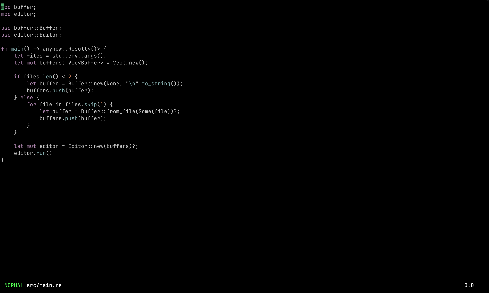

# ziv - rust editor

ziv is a research/passion project to create a modal text editor in Rust from scratch.



## Quickstart

This is a preliminary version of the final readme, but this section should get you up and running.

Clone the git repo

```shell
git clone https://github.com/raivokinne/ziv.git
cd ziv
```

Install it

```shell
cargo install --path .
```

Run it

```shell
ziv <file-to-edit>
```

## Testing

If you find any issues be more welcome to report them. Since red's still very immature and unstable make sure you check the known issues first:

https://github.com/raivokinne/ziv/issues/

Thank you so much for trying it! <3
